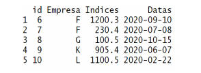

## Exercício computacional I
### Dataframes podem ser interpretados como tabelas de dados ou dados tabulados e, talvez, sejam uma das estruturas de dados linha-coluna mais importantes na linguagem R no momento em que pensamos em aplicá-la para ciência de dados. Por isso, esse exercício tem um propósito básico: criar e explorar comandos básicos relacionados com dataframes no R.


1) Crie o dataframe mostrado na figura acima e armazene no objeto df

```{r}
df <- data.frame(
  id = c (1:5),
  Empresa = c("A","B","C","D","E"),
  Indices = c(500.3,530.2,630.5,400.20,940.20),
  Datas = as.Date(c("2020-03-05", "2020-04-21", "2020-12-10", "2020-10-15","2020-09-20")),
  stringsAsFactors = FALSE)
df
```


2) Utilize a função str() e interprete os resultados sobre cada tipo de dado contido no dataframe
```{r}
str(df)
```

Neste dataframe temos 5 observações e 4 variáveis. As variáveis encontradas são id (int), Empresa (chr), Indices (num), Datas (Date)

3) Faça a extração apenas das colunas de empresas e índices
```{r}
df2 <- data.frame(df$Empresa, df$Indices)
df2
```


4) Crie um array com os elementos relacionados com: a primeira (1) e terceira (3) linhas e a
segunda (2) e quarta (4) colunas.
```{r}
array_elementos <- df[c(1,3),c(2,4)]
array_elementos
```


5) Adicione uma nova coluna ao dataframe com os setores empresariais "IT", "adm", "executivo",
"RH", "O&M" e armazene em novo dataframe chamado df3
```{r}
df3 <- df
df3$setores <- c("IT", "adm", "executivo", "RH", "O&M")
df3
```


6) Combine o dataframe do item 1), dado por df, com o novo dataframe mostrado abaixo e
armazene o resultado, também como dataframe, no objeto dfn. Estude as funções rbind e
cbind para isso.



```{r}
dfn <- data.frame(
  id = c(6:10),
  Empresa = c("F", "F", "G", "K", "L"),
  Indices = c(1200.3, 230.4, 100.5, 905.4, 1100.5),
  Datas = c("2020-09-10", "2020-07-08", "2020-10-15", "2020-06-07", "2020-02-22"),
  stringsAsFactors = FALSE
)

dfn
```

\textcolor{blue}{As funções rbind() e cbind() são utilizadas para combinar vetores do mesmo tamanho. A diferença entre elas é que rbind() vai combinar os dados como linhas e o cbind() as combinará como colunas.}

```{r}
dfn <- rbind(df, dfn)
dfn
```
