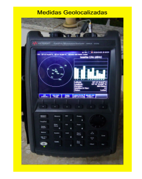

```{r echo=FALSE}
library(stringr)
library(ggplot2)
library(maps)
library(mapdata)
library(leaflet)
library(stringr)
```

# Exercício Computacional III

## Conceito explorado: Estatística Descritiva e Análise Exploratória de Dados

A Figura abaixo mostra um instrumento de teste (Field Fox Keysight) que pode ser usado em labo-
ratório ou em campo para medições de sinais de radiofrequência como os presentes em sistemas de comunicações sem fio. Isso significa que podemos usar esse equipamento para análise de redes sem
fio, cobertura de operadoras de telecomunicações, além de testes com dispositivos de RF e outros
equipamentos de telecomunicações.
Nesse contexto, utilizamos esse equipamento para a realização de medições de intensidade de sinal no campus do Inatel a fim de levantar a cobertura de uma rede sem fio experimental, configurada para transmitir sinais na faixa de frequência de ondas milimétricas. O estudo de cobertura e propagação nessa faixa de frequência é um aspecto de pesquisa relevante para sistemas de comunicações da quinta geração de redes móveis. Nesse exercício, temos o objetivo de fazer a análise exploratória de dois conjuntos de dados, dataset_1 e dataset_2 exportados pelo instrumento de teste.



1) Faça a importação do arquivos dataset_1 e dataset_2 exportados pelo equipamento para o
ambiente do RStudio.
```{r}
dataset_1 <- read.delim("Datasets/dataset_1.csv",stringsAsFactors = FALSE)
dataset_2 <- read.delim("Datasets/dataset_2.csv",stringsAsFactors = FALSE)
```

2) Análise o resultado da importação, como as estruturas e tipos de variáveis. Quais são as
principais informações contidas no arquivo?
```{r}
head(dataset_1, 21)
```

```{r}
head(dataset_2, 21)
```

Mediante a observação dos dados carregados é possível dizer que os dados a serem utilizados estão conditos a partir da linha 21.

Criando função para extrair informações das medidas.
```{r}
obter_medidas <- function(data) {
   data[21:nrow(data)-1,]
}
```

Obtendo informações das medidades do dataset_1
```{r}
medidas_1 <- obter_medidas(dataset_1)
head(medidas_1)
```

Obtendo informações das medidades do dataset_1
```{r}
medidas_2 <- obter_medidas(dataset_2)
head(medidas_2)
```

Cria função para extrair amostrar de coleta
```{r}
# A partir de uma amostra descobre onde se encontra a primeira "," 
amostra <- medidas_1[21]
local <- str_locate(amostra,",")

create_amostras_df = function(medidas, local) {
  data <- substr(medidas, start = local[1]+1, stop = local[1]+10) %>% 
    as.numeric() %>% data.frame()
  colnames(data) <- "Prx"
  data
}
```

```{r}
df1_table <- create_amostras_df(medidas_1, local)
head(df1_table)
```
```{r}
df2_table <- create_amostras_df(medidas_2, local)
head(df2_table)
```

3) Obtenha o histograma dos valores de potência de recepção coletados pelo equipamento em
cada conjunto de dados.
```{r}
hist(df1_table$Prx, probability = TRUE, breaks = 100, main = 'Estimação do Histograma df_table1')

```
```{r}
# Apresentando duas formas de gerar o histograma.
ggplot(df2_table, aes(x = Prx)) + geom_histogram(aes(y =..density..),
                                                 bins   = 50, 
                                                 colour = "black", 
                                                 fill = "white")

hist(df2_table$Prx, probability = TRUE, breaks = 100, main = 'Estimação do Histograma')

```


4) Em qual localidade específica foram realizadas as medições de cada conjunto de dados?

```{r}
get_coords <- function(data) {
  gps_lat_ponto_1  = data[12,1]
  # gps_lat_ponto_1
  gps_long_ponto_1 = data[13,1]
  # gps_long_ponto_1
  
  # Conversão de grau, minuto fracionado
  grau_lat_ponto_1        = substr(gps_lat_ponto_1, start = 17, stop = 18)
  minuto_lat_ponto_1      = substr(gps_lat_ponto_1, start = 19, stop = 26)
  grau_long_ponto_1       = substr(gps_long_ponto_1, start = 18, stop = 19)
  minuto_long_ponto_1     = substr(gps_long_ponto_1, start = 20, stop = 27)
  
  # Composição dos valores numéricos de latitude e longitude
  data.frame(
    lat = (-1)*(as.numeric(grau_lat_ponto_1) + as.numeric(minuto_lat_ponto_1)/60),
    lng = (-1)*(as.numeric(grau_long_ponto_1) + as.numeric(minuto_long_ponto_1)/60)
  )
}

coord <- get_coords(dataset_1)
coord
```

Plotando as coordenadas
```{r}
leaflet() %>%
  addTiles() %>%
  addMarkers(lng = coord$lng, lat = coord$lat,
             popup = 'ponto a',
             clusterOptions = markerClusterOptions())
```

