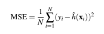

# Exercício Computacional V

Conceito explorado: MSE - Mean Square Error

Considere o seguinte modelo de geração de dados mostrado abaixo:
$$
y = h(x) +ε
$$

(1.3)

Nesse modelo, h(x) = 3x+30 consiste na função hipótese verdadeira, muitas vezes desconhecida na
prática de ML, e ε é um termo que expressa a incerteza entre os valores da função hipótese verdadeira e a variável de saída ou resposta y. Estatisticamente, ε é interpretado como um ruído, que nesse exercício segue a distribuição de probabilidade Gaussiana com média μ = 0 e desvio padrão σ = 15.
A notação em negrito usada ocorre em função de (1.3) ser um modelo vetorial de dados.
A variável explanatória x usada será um vetor de valores inteiros de zero (1) a cem (100). Logo, o
modelo de dados é formado pelos vetores y, h(x) e ε, sendo cada um com dimensões (número de
linhas e colunas) de 100×1.
Considere que um grupo de cientistas de dados já realizaram o trabalho de modelagem e encontraram
uma função hipótese candidata dada por:
$$
hˆ(x) = 2.8x+32
$$

(1.4)

1) Construa esse modelo de geração de dados. Para que seja possível a reprodução de resultados
em função do vetor aleatório ε utilize a semente (seed) 123 em seu código.

```{r}
# Quantidade de amostras
n <- 100

#Gerando as amostras
x <- seq(1, 100, length.out = n)

# Função hipótese verdadeira
h_x <- 3*x + 30

set.seed(123)

#Ruido
?rnorm
epsilon <- rnorm(n, 0, 15)

# Variável de saída
y <- h_x + epsilon
```


2) Faça um gráfico de dispersão da variável explanatória x com saída conhecida y.
```{r}
plot(x, y, col=1, pch=1, main = 'Gráfico de Dispersão', 
     col.main = 'black', 
     xlab = 'Variável Explanatória',
     ylab = 'Variável de Saída')
grid()
```


3) Obtenha o histograma relacionado com a variável de saída y.
```{r}
hist(y, main = "Histograma da variável de saída (y)")
```

4) A equação do MSE, mostrada abaixo, é uma métrica de desempenho relacionada com qual
tipo de tarefa de aprendizagem de máquina?

(1.5)

Statistical learning

5) Faça a estimação do erro quadrático médio do modelo proposto pelos cientistas.
```{r}
# Função hipótese Estimada
h_x_estimado <- 2.8*x + 32
MSE = (1/n)*sum(((y - h_x_estimado)^2))
MSE
```


6) Faça uma análise: o modelo proposto é plausível para explicar os dados? De quais fatores
esse desempenho depende?

** Não ficou muito claro para mim, revisar.